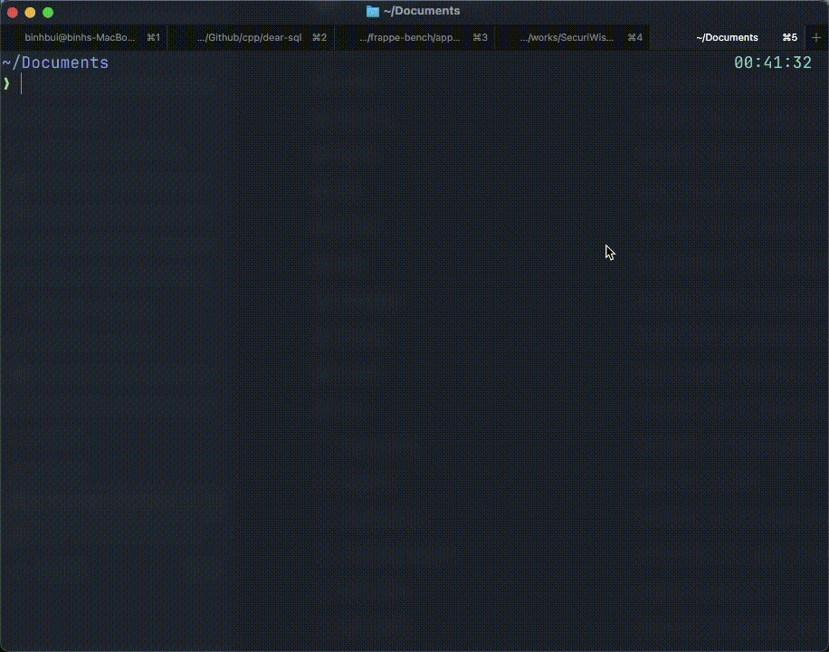

# DevTidy

A terminal UI app to clean up development dependencies and build artifacts.

### Demo


## What it cleans

### Default mode
- `node_modules` (Node.js)
- `target` (Rust)
- `__pycache__`, `venv` (Python)
- `build`, `dist` (Build artifacts)
- `.gradle` (Java)
- `deps`, `_build` (Elixir)
- `.next`, `.turbo`, `.nuxt` (Next.js, Turborepo, Nuxt.js)
- `.idea`, `.vscode` (IDE configs)
- `coverage`, `.nyc_output` (Test coverage)
- `.cache`, `.sass-cache`, `.parcel-cache` (Cache files)
- `.yarn`, `.pnpm-store` (Package manager caches)
- `.terraform` (Terraform cache)
- `.DS_Store`, `Thumbs.db` (System files)
- Log files, temp files, and more

### Gitignore mode (`--gitignore`)
- Files and directories matching patterns in `.gitignore`
- Requires a `.gitignore` file in the target directory

## Install

### Homebrew (macOS/Linux)
```bash
brew install --cask harryduc/brews/devtidy
```

### Go install
```bash
go install github.com/harryduc/devtidy@latest
```

## Usage

```bash
# Scan current directory
devtidy

# Scan specific directory
devtidy /path/to/dir

# Preview without deleting (dry-run mode)
devtidy --dry-run

# Only show items larger than specified size
devtidy --min-size 100MB
devtidy --min-size 1GB

# Combine options
devtidy --dry-run --min-size 500MB /path/to/project

# Use .gitignore patterns
devtidy --gitignore
```

## Controls

### Navigation
- `↑/↓ or k/j` - Navigate items
- `/` - Filter items
- `q` - Quit

### Selection
- `space` - Toggle selection (✓ = selected)
- `a` - Select all items
- `d` - Deselect all items
- `i` - Invert selection

### Sorting
- `s` - Sort by size (largest first)
- `n` - Sort by name (A-Z)
- `t` - Sort by type

### Actions
- `c` - Clean selected items

## Options

- `--gitignore` - Scan files matching `.gitignore` patterns
- `--dry-run` - Preview what would be cleaned without deleting
- `--min-size` - Only show items larger than specified size (e.g., `100MB`, `1GB`)
- `-h, --help` - Show help message
- `-v, --version` - Show version information

## Safety

- Only cleans items you explicitly select
- Shows size before cleaning
- Use `--dry-run` to preview without deleting
- Filter by size with `--min-size` to focus on large items
